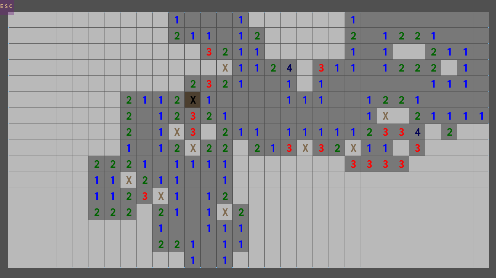

## Minesweeper Clone

### Description

Just a minesweeper clone in raylib made for educational purposes. May expand with additional fatures as seen in the "Work In Progress" roadmap below.

### Features + WIP Roadmap

 - Basic Minesweeper gameplay [WIP]
   - flagging
   - floodfill clearing
   - chording
 - Parameterized board generation [WIP]
   - variable board size [WIP]
   - variable mine density [WIP]
   - no-guess gamemode [WIP]
 - Speed-scrolling style multiplayer (similar to Tetris99) [WIP]
   - TBD

### Controls

Mouse:
 - Left Click: Reveal tile
 - Right Click: Flag tile
 - Middle Click: Chord

### Screenshots

_TODO: Show your game to the world, animated GIFs recommended!._

### Developers

 - DoughnutDude - Developer/Designer

### Links

 - YouTube Gameplay: $(YouTube Link)
 - itch.io Release: $(itch.io Game Page)
 - Steam Release: $(Steam Game Page)

### License

This game sources are licensed under an unmodified zlib/libpng license, which is an OSI-certified, BSD-like license that allows static linking with closed source software. Check [LICENSE](./minesweeper-clone/LICENSE) for further details.

$(Additional Licenses)

*Copyright (c) 2023 (DoughnutDude)*
